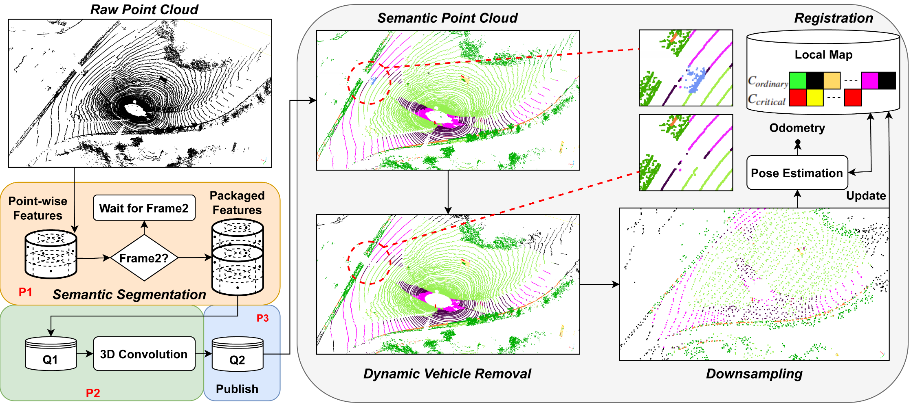

<div align="center">
    <h1>SAGE-ICP</h1>
    <a href=https://ieeexplore.ieee.org/document/10610280>Paper</a>
    <span>&nbsp;&nbsp;•&nbsp;&nbsp;</span>
    <a href=https://arxiv.org/abs/2310.07237>Arxiv</a>
    <span>&nbsp;&nbsp;•&nbsp;&nbsp;</span>
    <a href=https://www.youtube.com/watch?v=6bXX2PnEjj4>YouTube</a>
    <span>&nbsp;&nbsp;•&nbsp;&nbsp;</span>
    <a href=https://www.bilibili.com/video/BV1BH4y1o7N3/?spm_id_from=333.999.0.0>bilibili</a>
    <br />
    <br />
    
[SAGE-ICP](https://ieeexplore.ieee.org/document/10610280) is a semantic information-assisted point-to-point ICP ([ICRA 2024](https://2024.ieee-icra.org/), accepted).  
  <br />
[Jiaming Cui](https://github.com/shashenyiguang), Jiming Chen, [Liang Li](https://github.com/liangli1990)  

  <p align="center">
    <a href="https://www.youtube.com/watch?v=6bXX2PnEjj4"></a>
  </p>
</div>
<hr />

## Prerequisites
1. [ROS2](https://www.ros.org/blog/getting-started/)  
2. Dependencies
```sh
sudo apt-get install ros-<ros_distro>-tf-transformations
pip install transforms3d kiss-icp lark-parser
```
3. Semantic segmentation models for LiDAR point clouds, could select one installation.  
[Cylinder3D](https://github.com/NeSC-IV/cylinder3d_ros2), [RangeNet++](https://github.com/NeSC-IV/RangeNetTrt8) 

## Install
```sh
mkdir -p ~/sage-icp/src && cd ~/sage-icp/src
git clone https://github.com/NeSC-IV/sage-icp.git
cd .. && colcon build --symlink-install
```

## Evaluation
To evaluate cylinder3D on KITTI Odometry, please run:
```sh
source install/setup.bash
ros2 launch sage_icp sem_odom.launch.py
```
To evaluate RangeNet++ on KITTI Odometry, please run:
```sh
source install/setup.bash
ros2 launch sage_icp range_odom.launch.py
```

## Citation

If you use this library for any academic work, please cite our original [Paper](https://ieeexplore.ieee.org/document/10610280).
```sh
@INPROCEEDINGS{10610280,
  author={Cui, Jiaming and Chen, Jiming and Li, Liang},
  booktitle={2024 IEEE International Conference on Robotics and Automation (ICRA)}, 
  title={SAGE-ICP: Semantic Information-Assisted ICP}, 
  year={2024},
  volume={},
  number={},
  pages={8537-8543},
  keywords={Location awareness;Training;Laser radar;Accuracy;Semantic segmentation;Semantics;Pose estimation},
  doi={10.1109/ICRA57147.2024.10610280}}
```


## Acknowledgements
This repo is built upon [KISS-ICP](https://github.com/PRBonn/kiss-icp), [Cylinder3D](https://github.com/xinge008/Cylinder3D) and [RangeNet++](https://github.com/PRBonn/rangenet_lib).  
This project is free software made available under the MIT License. For details see the LICENSE file.